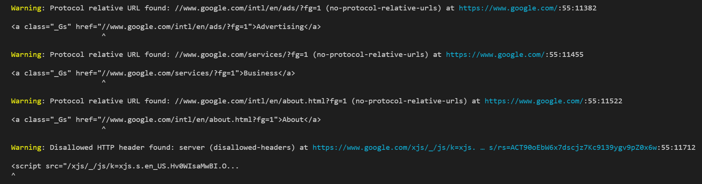

# List of official formatters

The current supported `formatter`s are:

* `json` does a `JSON.stringify()` of the results. Output
  is not user friendly:

* `stylish` prints the results in table format indicating the resource,
  line, and column:

* `codeframe` shows also the code where the error was found if: Will
  show the piece of code where the error was found (if applicable):

