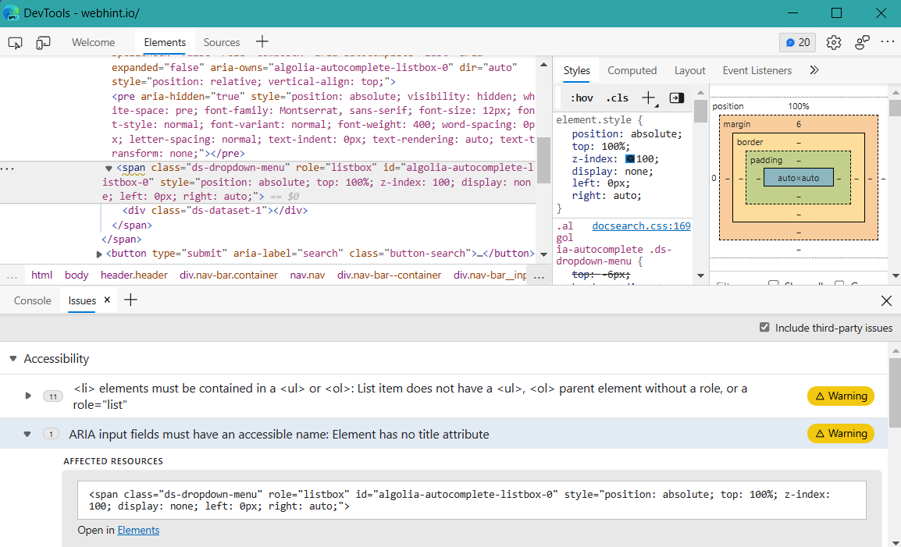
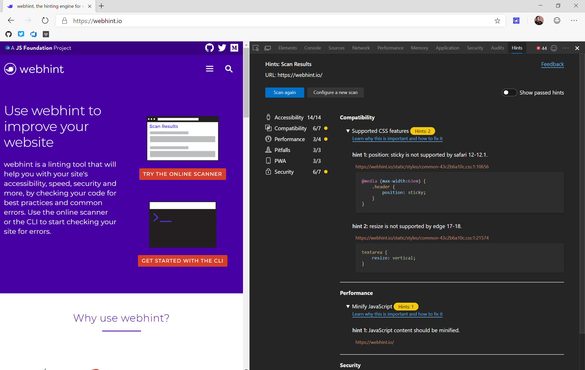
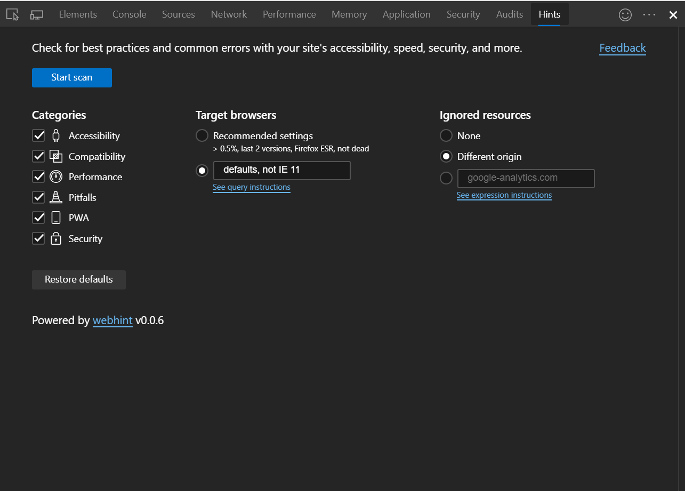

# Webhint DevTools integration

Use webhint directly from your browser DevTools to get feedback while debugging.

## DevTools integration (Edge)

As of 2021, webhint is included by default in Edge DevTools. With DevTools
open, webhint will analyze sites automatically, and results and recommended
fixes will appear in the Issues tab. Additionally, underlines in the Elements
tab show which parts of the codebase are affected. To learn more, visit the
[Microsoft Edge documentation](https://docs.microsoft.com/en-us/microsoft-edge/devtools-guide-chromium/issues/).

## DevTools extension (Chrome, Edge, Firefox)

The webhint browser extension provides a visual interface within DevTools that
allows you to run and re-run site scans that test against all browsers and
all hint types or to just a select few.

To install the browser extension, click one of the links below and follow the
installation instructions.

 > Note: The links below redirect to externally-hosted storefronts.

- [webhint browser extension for Google Chrome](https://chrome.google.com/webstore/detail/webhint/gccemnpihkbgkdmoogenkbkckppadcag)
- [webhint browser extension for Microsoft Edge (Chromium)](https://microsoftedge.microsoft.com/insider-addons/detail/mlgfbihcfnkaenjpdcngdnhcpkdmcdee)
- [webhint browser extension for Mozilla Firefox](https://addons.mozilla.org/en-US/firefox/addon/webhint/)

Open DevTools in the browser. Once the webhint extension is installed, it will
appear as a tab within DevTools. From here, you can customize the scan by
selecting which hint categories, browsers, or resources to include or exclude.
Click "Start scan" to begin scanning the site.

To contribute to the extension please read the [`CONTRIBUTING.md`][contributing]
file of the package.

<!-- Link labels -->

[contributing]: https://github.com/webhintio/hint/blob/main/packages/extension-browser/CONTRIBUTING.md
