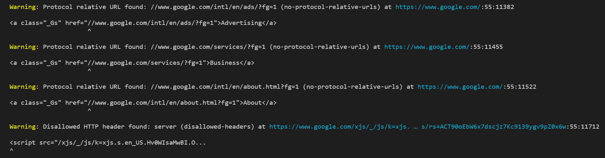

# Formatter codeframe (`@sonarwhal/formatter-codeframe`)

The `codeframe` formatter shows the results in table format indicating the
resource, line and column as well as some code where the error was found (if
applicable):



To use it you need to configure your `.sonarwhalrc` file as follows:

```json
{
    "formatters": "codeframe"
}
```
