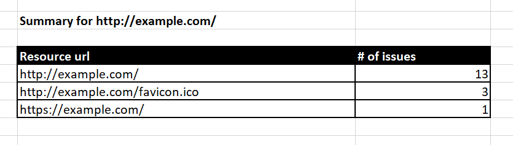
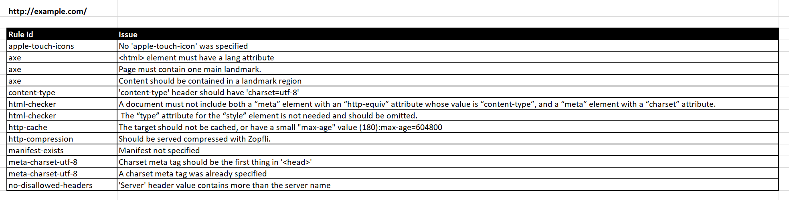

# Formatter excel (`@sonarwhal/formatter-excel`)

The `excel` formatter outputs the results in an Excel file (xlsx), each
resource in its sheet:





To use it you need to configure your [`.sonarwhalrc`][sonarwhalrc] file
as follows:

```json
{
    "connector": {...},
    "formatters": "excel",
    "rules": {
        ...
    },
    ...
}
```

<!-- Link labels: -->

[sonarwhalrc]: https://sonarwhal.com/docs/user-guide/further-configuration/sonarwhalrc-formats/
