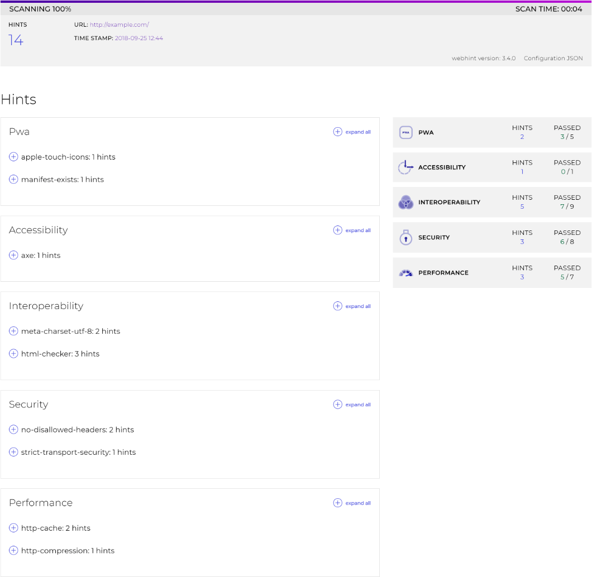

# HTML (`@hint/formatter-html`)

The `html` formatter outputs the result in a HTML file.



A new folder `hint-report` will be created with the results.

This package is installed automatically by webhint:

```bash
npm install hint --save-dev
```

To use it, activate it via the [`.hintrc`][hintrc] configuration file:

```json
{
    "connector": {...},
    "formatters": ["html"],
    "hints": {
        ...
    },
    ...
}
```

**Note**: The recommended way of running webhint is as a `devDependency` of
your project.

<!-- Link labels: -->

[hintrc]: https://webhint.io/docs/user-guide/configuring-webhint/summary/
