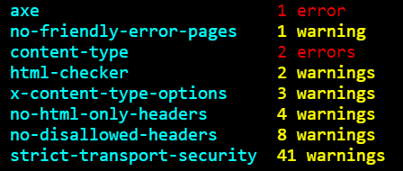

# Summary (`@hint/formatter-summary`)

The `summary` formatter prints the results of a site analysis in
a table with how many errors or warnings a hint has found:



This package is installed automatically by webhint:

```bash
npm install hint --save-dev
```

To use it, activate it via the [`.hintrc`][hintrc] configuration file:

```json
{
    "connector": {...},
    "formatters": ["summary"],
    "hints": {
        ...
    },
    ...
}
```

**Note**: The recommended way of running webhint is as a `devDependency` of
your project.

<!-- Link labels: -->

[hintrc]: https://webhint.io/docs/user-guide/configuring-webhint/summary/
