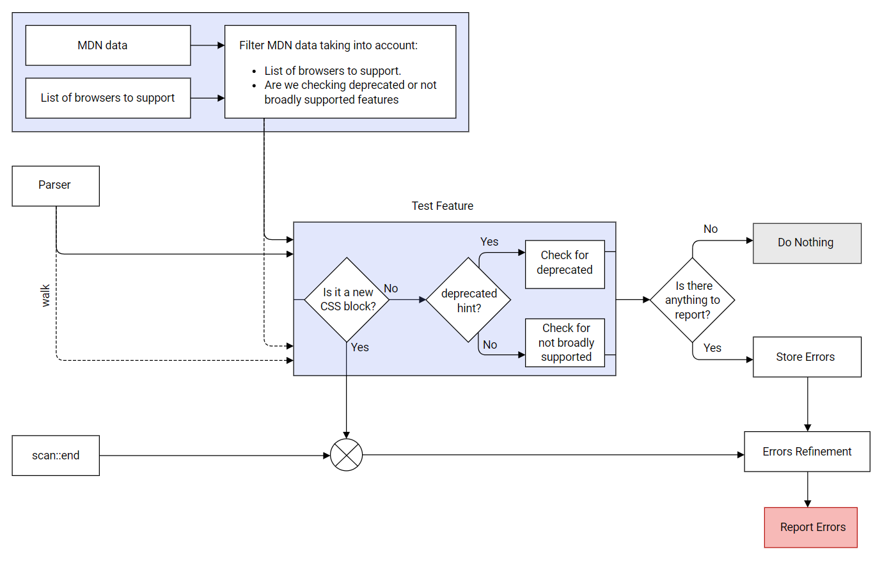

# Architecture

This hint groups 4 different hints:

* Hint for deprecated CSS features.
* Hint for not broadly supported CSS features.
* Hint for deprecated HTML features.
* Hint for not broadly supported HTML features.

It relies on the data from [`browser-compat-data`][browser-compat-data] to
know the status of [CSS][browser-compat-data-css] and [HTML][browser-compat-data-html] features.

## CLI Flow

Every single hint takes [`the provided browserlist by the user (or the default
one)`][browser-context] and the hint context to filter the list of features to test. 

Once the previous step is done, the parser exposes sequentially all the features
included in the resource (CSS or HTML) and it proceeds testing the feature if
needed and not included in the `ignore` built-in list. All the errors reported 
are temporary stored and consumed once the `scan::end` event is obtained.

<!-- Link labels: -->

[browser-compat-data]: https://github.com/mdn/browser-compat-data
[browser-compat-data-css]: https://github.com/mdn/browser-compat-data/tree/master/css
[browser-compat-data-html]: https://github.com/mdn/browser-compat-data/tree/master/html
[browser-context]: https://webhint.io/docs/user-guide/configuring-webhint/browser-context
