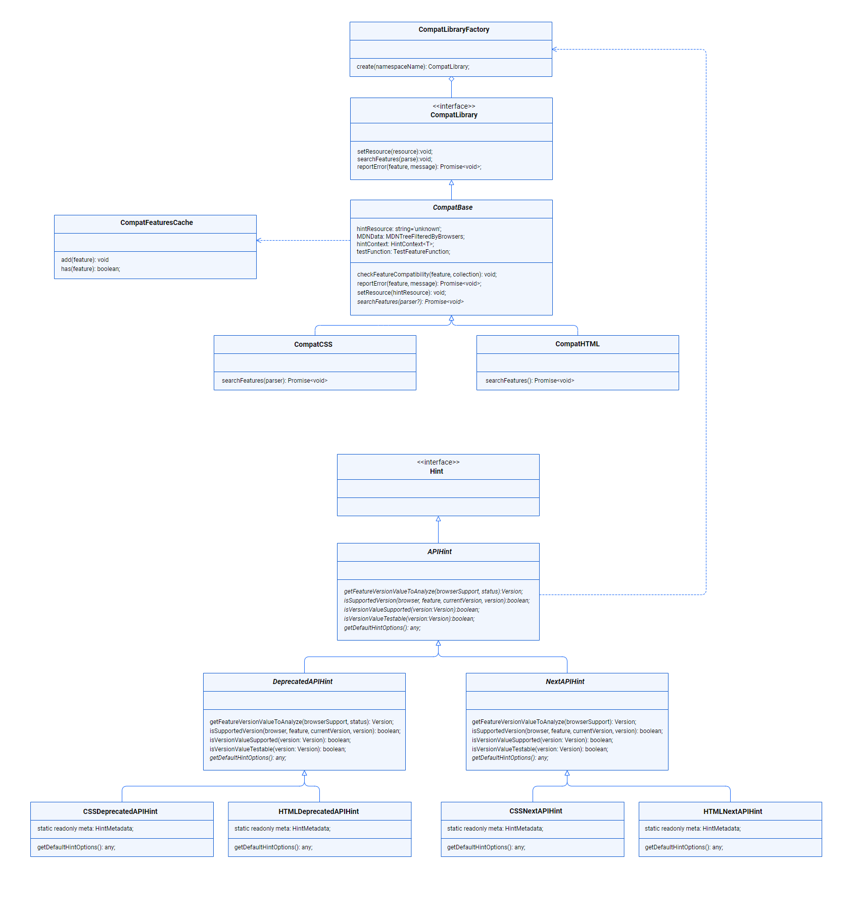

# Architecture

This hint groups 4 different hints:

* Hint for deprecated CSS features.
* Hint for not broadly supported CSS features.
* Hint for deprecated HTML features.
* Hint for not broadly supported HTML features.

It relies on the data from [`browser-compat-data`][browser-compat-data] to
know if a [CSS][browser-compat-data-css] or [HTML][browser-compat-data-html]
feature is supported or deprecated.

## CLI Flow

Every single hint takes [`the provided browserlist by the user (or the default
one)`][browser-context] and the hint context to filter the list of features to
test.

Once the previous step is done, the parser exposes sequentially all the features
included in the resource (CSS or HTML). The hint then test each feature as it is
exposed, as long as it is not in the `ignore` built-in list. All the errors
reported are temporarily stored and consumed once the `scan::end` event is 
obtained.

As explained above, the errors are not reported when detected, they are stored
and refined before **we** publish them. The flow of finding and reporting errors
in this hint differs greatly from the rest of the hints.

Ideally, we should only report errors that add value. However, when checking a
CSS file, it is possible to deal in a scenario where a feature being used has
never been implemented or is deprecated, even if vendor prefixes are applied.
The CSS file might use the feature with its standard name and with vendor
prefixes.

Under the normal flow of events, we would report an error for every feature, so
`-webkit-box-lines` and `box-lines` would each produce an error, when, in fact,
it is sufficient to report an error for the non-prefixed version of the feature.

To achieve this, we store all the errors are they are found. If, at the end we
find we have multiple errors for the same feature, we only report an error with
the name of the feature, discarding its prefixed versions.

<!-- Link labels: -->

[browser-compat-data]: https://github.com/mdn/browser-compat-data
[browser-compat-data-css]: https://github.com/mdn/browser-compat-data/tree/master/css
[browser-compat-data-html]: https://github.com/mdn/browser-compat-data/tree/master/html
[browser-context]: https://webhint.io/docs/user-guide/configuring-webhint/browser-context
