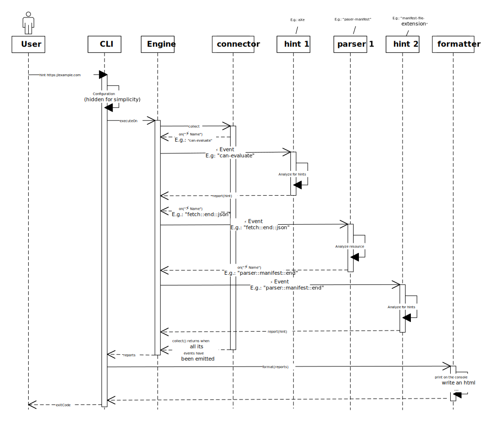
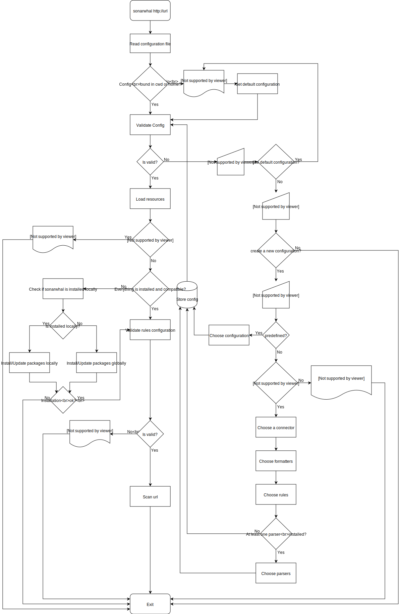

# Architecture

The core concepts in `webhint` are:

* `hint`: Is a group of related tests that are run on a resource (HTML,
  document, image, request, tool configuration files, etc.). E.g.: Verify that
  the HTML document has a valid language declared. [Learn how to develop a
  `hint`][new hint].
* `connector`: Is the way in which `webhint` obtains information about the DOM,
  network information, resources, etc. The underlying technique (debugging
  protocol, web driver, etc.) to access this data does not matter to the rest of
  the system. [Learn how to develop a `connector`][new connector].
* `parser`: Understands a particular resource type (e.g.: JavaScript,
  stylesheet, webmanifest, etc.), and exposes information about them so `hint`s
  can take action on them. [Learn how to develop a `parser`][new parser].
* `formatter`: Transforms the results into something useful to the user. It
  could be as simple as printing out the results to the command line, or
  something more complex like creating an HTML report. [Learn how to developer a
  `formatter`][new formatter].

All these pieces communicate with each other via [`event`s][events]. `Engine`,
which extends from `EventEmitter`, is the one enabling this interaction. Most of
the new work is done in one of the previous components as `Engine` should be
kept as simple as possible. The entities emitting events are `connector`s and
`parser`s. The ones that subscribe to `event`s are `hint`s and `parser`s.

## CLI Flow

The following is a sequence diagram of how things interact with each other when
running `webhint` from the CLI via `hint https://example.com`:

1. The `CLI` creates a new `HintConfig` object based on the user's `.hintrc`
   file. This process validates that the hints are configured correctly, etc. If
   the there is no `.hintrc` file, `webhint` will use a [default
   configuration][default configuration].
1. The `CLI` then passes this `HintConfig` to the `resource-loader` that will
   return a `HintResources` object that contains the `Constructors` of the
   configured resources. `resource-loader` checks at the same time if the
   resources actually exist, are compatible with the current `webhint` version,
   etc. If there are missing dependencies, the names will be in the `missing`
   property of the result. For incompatibilities, it will be the `incompatible`.
1. If everything goes well, a new `Engine` object is created using the previous
   `HintConfig` and `HintResources`, then `CLI` calls its `executeOn` method.
1. `Engine` then calls the `collect` method (`async`) of the configured
   `connector`.
1. The `connector` will navigate to the `URL`, traverse the HTML, and send
   `event`s related to this and the loaded resources.
1. If a `parser` has subscribed to one of the emitted `event`s, it will parse
   that resource and `emit` new `event`s.
1. `hint`s can subscribe to any `event` no matter where it's comming from
   (`connector` or `parser`). If they find an issue, it will be reported via the
   `report` method.
1. Once `collect` returns, the results are passsed then to `CLI` that will call
   the `format` method of all the configured `formatters`s.

Any developer can create their own `hint`s, `connector`s, `parser`s and/or
`formatter`s, and use them without having to do a pull request to the main
project and distribute them as [`npm`][npm] packages.

## Resource loading

The resource loading of `webhint` for the CLI has many steps. The following is
the most up-to-date diagram of the interaction:

<!-- Link labels: -->

[default configuration]: ../../user-guide/index.md#default-configuration
[events]: ./events.md
[new connector]: ../how-to/connector.md
[new formatter]: ../how-to/formatter.md
[new parser]: ../how-to/parser.md
[new hint]: ../how-to/hint.md
[npm]: https://www.npmjs.com/
[typescript]: https://www.typescriptlang.org/
