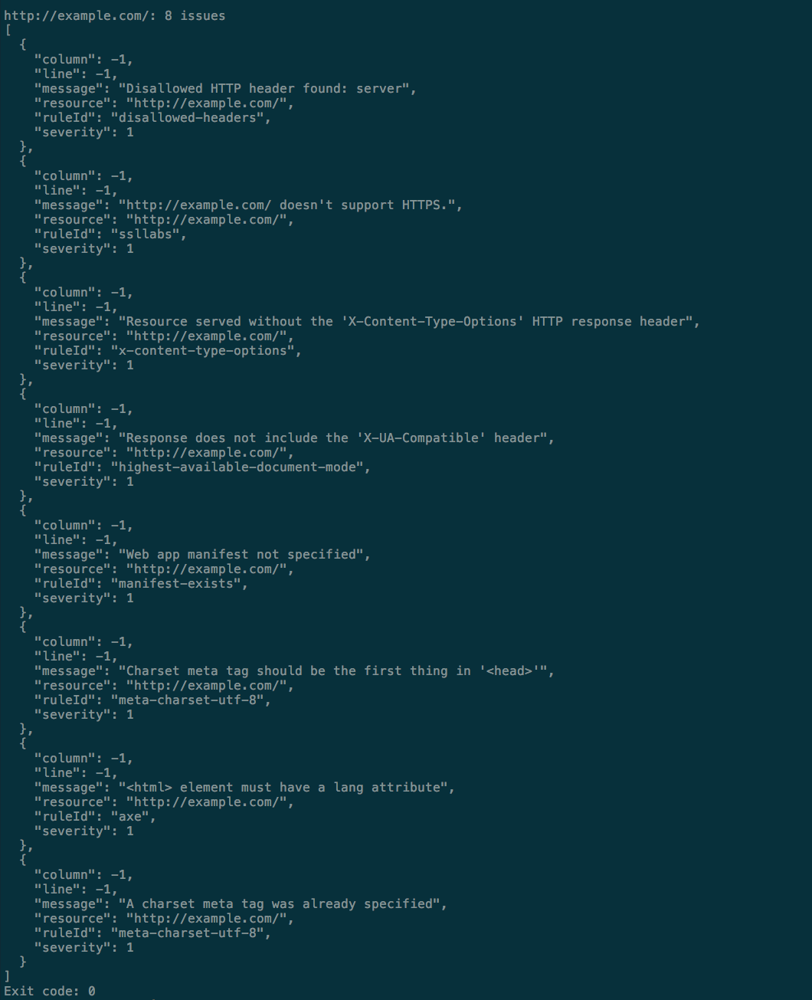
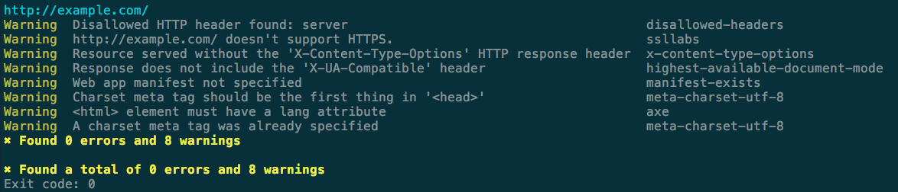
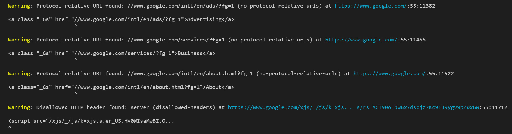
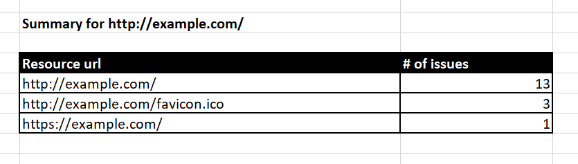
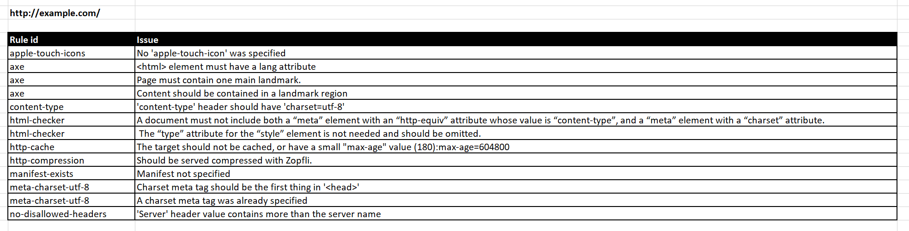

# Formatters

A formatter takes the results of executing the configured hints and
transforms them to be consumed by the user. A formatter can output
results to a file or the console, in various styles.

To choose a formatter, install its package and add that package name to
the `formatters` array within your .hintrc file. Packages within the
`@hint/` namespace (like, for example, `@hint/formatter-html`) can be
added using their short name.

```json
{
    "formatters": ["html"]
}
```

Since .hintrc accepts formatters as an array of strings, you can specify
more than one. An example use case would be wanting a summary printed to
the console as well as a full html report.

```json
{
    "formatters": [
        "summary",
        "html"
    ]
}
```

Or perhaps you wish you use a custom formatter in addition to or instead
of the official packages. Any package matching the pattern
`@hint/formatter-`, `webhint-formatter-`, or
`@scope/webhint-formatter-` should be a valid candidate.

```bash
npm i -D @myOrg/webhint-formatter-bubble-letters
```

```json
{
    "formatters": [
        "html",
        "@myorg/webhint-formatter-bubble-letters"
    ]
}
```

## List of official formatters

The officially supported formatters that can be installed via `npm` are:

* [`@hint/formatter-json`][formatter-json] does a `JSON.stringify()` of
  the results. Output is not user friendly:

  

* [`@hint/formatter-stylish`][formatter-stylish] prints the results in
  table format indicating the resource, line, and column:

  

* [`@hint/formatter-codeframe`][formatter-codeframe] shows also the code
  where the error was found if applicable:

  

* [`@hint/formatter-summary`][formatter-summary] shows a summary
  of all the warnings and errors found for all the resources:

  

* [`@hint/formatter-excel`][formatter-excel] creates an Excel spreadsheet
  with a sheet containing the results per resource:

  

  

* [`@hint/formatter-html`][formatter-html] creates an HTML page in
  the folder `hint-report/<url_analyzed>` with the result:

  

  _Note: If you are running custom hints, the buttons "Why is this
  important" and "How to solve it" will not work._

If you want to implement your own formatter, visit the [contributor
guide][].

<!-- Link labels: -->

[contributor guide]: ../../contributor-guide/how-to/formatter.md
[formatter-json]: https://npmjs.com/package/@hint/formatter-json
[formatter-stylish]: https://npmjs.com/package/@hint/formatter-stylish
[formatter-codeframe]: https://npmjs.com/package/@hint/formatter-codeframe
[formatter-summary]: https://npmjs.com/package/@hint/formatter-summary
[formatter-excel]: https://npmjs.com/package/@hint/formatter-excel
[formatter-html]: https://npmjs.com/package/@hint/formatter-html
