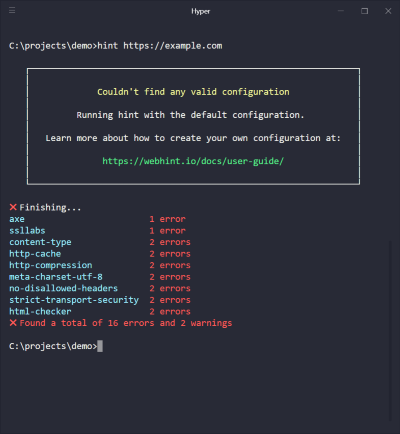

# Configuring webhint

There are 2 ways in which you can configure `webhint`:

1. Via a `.hintrc` file.
1. Adding a `hintConfig` property in your `package.json`.

To create a basic `.hintrc` file you can use the following command:

```bash
npm create hintrc
```

If `webhint` cannot find a (valid) configuration, it will use a default
one and warn you about it.



In both cases, the format used is the same. The following is an example
for a `.hintrc`:

```json
{
    "connector": {
        "name": "connectorName"
    },
    "formatters": ["formatterName"],
    "parsers": ["parserName"],
    "hints": {
        "hint1": "error",
        "hint2": "warning",
        "hint3": "off"
    },
    "hintsTimeout": 120000
}
```

And for a `package.json`:

```json
{
    "name": "project name",
    "dependencies": {
        ...
    },
    "scripts": {
        ...
    },
    ...
    "hintConfig": {
        "connector": {
            "name": "connectorName"
        },
        "formatters": ["formatterName"],
        "parsers": ["parserName"],
        "hints": {
            "hint1": "error",
            "hint2": "warning",
            "hint3": "off"
        },
        "hintsTimeout": 120000
    }
}
```

The main things you can configure are:

* `connector`:  how to access the resources.
* `formatter`s: how to output the results.
* `parser`s: how to handle special files like stylesheets, JavaScript,
  manifest, etc.
* `hint`s: what to test for and the `severity` it should have.

The `severity` of a `hint` can be:

* `off`: The `hint` will not be run. This is the same as deleting it
  from the `.hintrc`.
* `warning`: If the `hint` finds any issue it will be reported but the
  exit code will be `0`.
* `error`: If the `hint` finds any issue it will be reported and the
  exit code will be `1`.

`webhint` allows you to configure it in many different ways. Please
check the other entires under _Configuring webhint_ and the main page
for each package to have more details.

## Setting options via environment variables

It is possible to set webhint options via environment variables. To do
so you have to create a variable prefixed by `webhint_` where each
"word" is another property. E.g.:

```text
"webhint_connector_options_waitFor" = "60000"
```

will get transformed to:

```json
{
    "connector": {
        "options": {
            "waitFor": 60000
        }
    }
}
```

and get merged with your `.hintrc`. Keep in mind that if a key already
exists in `.hintrc` it will take precedence.

An example where you might want to do this is for providing credentials
and not storing them in a file.
