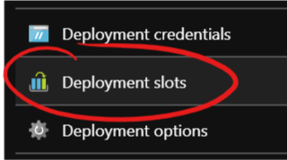
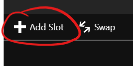
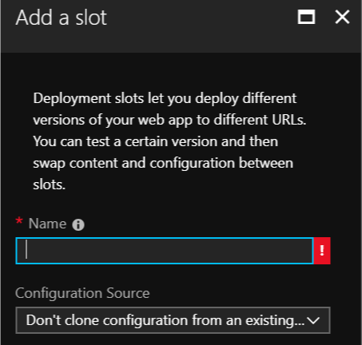
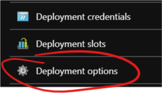
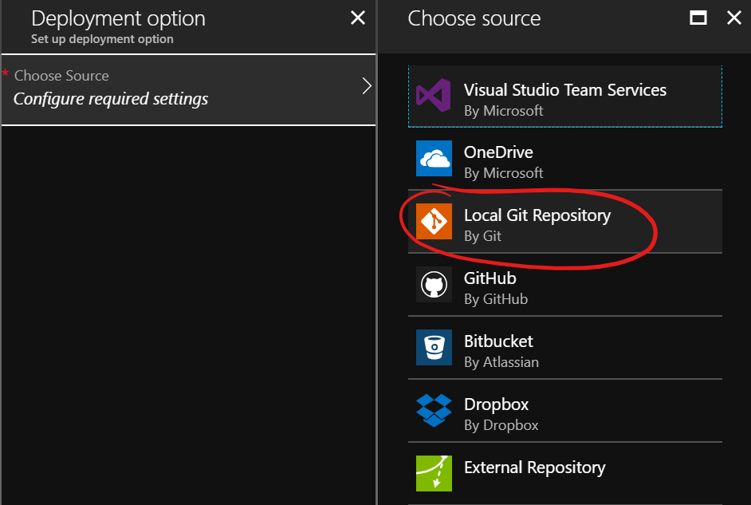
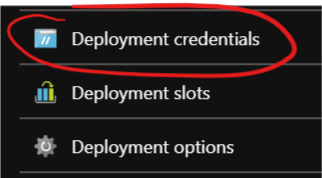
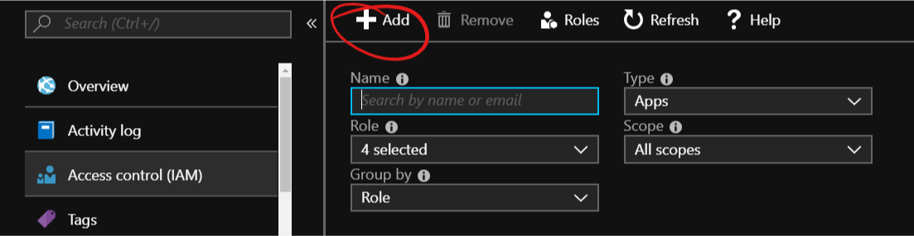
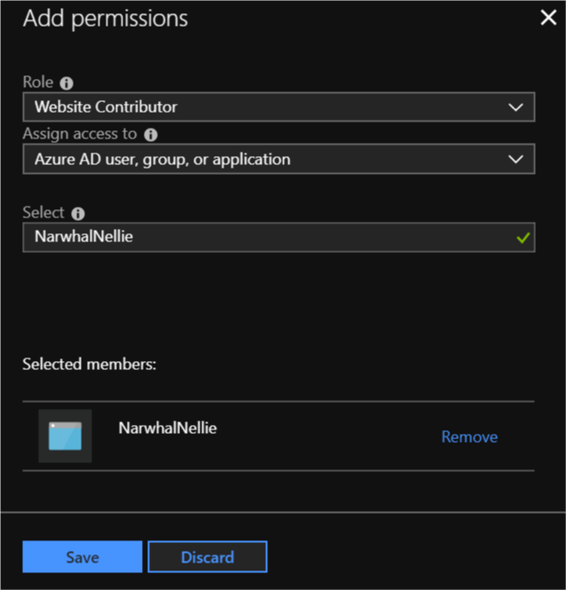

# Travis CI and Azure Web Apps

Azure Web Apps allows developers to have different environments or slots
for the same website (learn more [here][slots]). Slots are useful if you
want to test things right before going into production in an environment
similar to it (they could be virtually identical).

In the case of [webhint.io][webhint.io] we have 2 slots or environments
and the process of changing the code from one place to another is done
via a custom Travis CI script.

The TL;DR; version is:

* **Staging**: Every time there is a change into the documentation of
  [the CLI's repo][webhint repo], or the [site's one][webhintio repo],
  the code is downloaded, built and deployed into staging automatically.
* **Production**: Once *staging* is updated, it gets tested and if no
  problems are found, the code gets promoted to *production*. Same as
  before, this is done automatically.

This guide documents how to deploy your website into an Azure Web App
slot, test it using `webhint`, and put it into production. All of this
using Travis CI.
It assumes the user has a Travis CI and an Azure account, this last one
with an Azure Web App already created.

## Create and configure a staging slot in your Azure Web App

To create a slot in your website you have to:

1. Select "Deployment slots" in the blade of your Azure Web App:

   

1. Select "Add Slot" in the blade that appears:

   

1. Choose a name (e.g.: "staging") and select a source to clone if
   applicable (e.g.: "production"). This will copy all the
   environment variables in the source such as `NODE_ENV=production`:

   

1. Select the new slot in the menu and then "Deployment options"

   

1. In the new menu, select "Local Git Repository"

   

At this moment you might have to create some "deployment credentials".
You can do so via the "Deployment credentials" option:



## Create and configure a service principal

This is an optional step, but recommended. You should create a service
principal with only access to the bare minimum. That way you do not have
to put your credentials anywhere (even if they are encrypted), and if
something happens you can easily revoke access to it.

1. To achieve this, you first need to [install the Azure CLI][azure cli].
   Then log in into your account using:

   ```bash
   az login
   ```

   A browser should open and give you access in the command line.

   **Note**: If your account has access to multiple Azure subscriptions,
make sure to choose the right one via
`az account set --subscription "My Subscription"`.

1. Then create a service principal:

   ```bash
   az ad sp create-for-rbac --name NAME --password PASSWORD --subscription "My Subscription"
   ```

   You should get an output like:

   ```json
   {
      "appId": "b583eadf-7643-4b67-91a1-eb057d9fe24f",
      "displayName": "NAME",
      "name": "http://NAME",
      "password": "PASSWORD",
      "tenant": "22cfb846-dedd-4bc1-b664-83c738e456e0"
   }
   ```

   You should write down this information, but the fields we will use later
are:

   * `name`
   * `password`
   * `tenant`

1. By default, service principals are created with the `Contributor` role.
   Unless you want this account to have access to anything, you should
   remove it and scope it down. For this case, the `Website Contributor`
   should be enough and you should give this role only for the Azure WebApp
   you are using.

   1. Go to the Azure Portal, select your Azure WebApp and click
   on "Access control (IAM)".
   1. Click on "+ Add".
      
   1. Search and select the service principal you created before.
   1. Add the "Website Contributor" role and click Save.
      

## Add and configure `webhint` in your project

First thing you have to do is add `webhint` to your project:

```bash
npm install hint --save-dev
```

Then you need a valid `.hintrc` file. For a starter file, use the
following command and answer the questions:

```bash
npm create hintrc
```

You can use the generated file as a starter point for your needs, ignoring
URLs you do not have control over, tweaking the configuration of some of the
hints, etc.

Finally, add a task to your `package.json` that will test the staging
environment:

```json
{
    ...
    "scripts": {
        "test:staging": "hint https://example-staging.azurewebsites.net",
        ...
    }
}
```

## Configure Travis CI

The last remaining piece is Travis CI. As stated earlier, Travis CI is in
charge of deploying, running the tests, and changing the code from staging
to production. And all of this from the `.travis.yml` of your project!

Travis has several steps and you can configure what scripts or actions
execute in each one. E.g.: `before_install`, `before_deploy`, `deploy`,
etc. To know more about the different steps, visit
[Travis CI's Build Lifecycle][travis lifecycle].

One thing to consider is that not all the scripts can break the build on
Travis. If you want to stop the process if `webhint` fails, you will have
to combine a few steps into one. There are more details further on, but you
can learn more in [Travis CI's Breaking the Build][travis breaking build].

### Deploy the code into staging

The staging slot should have a local Git repository. Every time there is
push event in this repository, Azure will trigger the installation process
(basically download the code and then execute `npm install`).

There are 2 ways to get the code into staging in Travis CI:

#### Travis CI Azure deploy

Travis CI has [built-in support to deploy to Azure][travis azure]. To enable it
you have to configure the following environment variables:

* `AZURE_WA_USERNAME`: User name to use for the deployment
* `AZURE_WA_PASSWORD`: Password to use for the deployment
* `AZURE_WA_SITE`: Site to deploy to. E.g.: `mysite`
* `AZURE_WA_SLOT`: Slot to deploy to. E.g.: `staging`

With the values above, Travis CI will deploy the code to
`https://mysite-staging.azurewebsites.net`.

It is recommended to encrypt these environment variables for security reasons.

**How to encrypt environment variables**:

1. Install `apt-get ruby ruby-dev` (Windows users can use WSL; macOS users do
   not need to do this).
1. Install the Travis CI gem: `gem install travis`
1. Log into Travis CI: `travis login`
1. Encrypt the variables:

   ```bash
   travis encrypt -r "<username>/<repository>" \
     AZURE_WA_USERNAME="<username>" \
     AZURE_WA_PASSWORD="<password>" \
     AZURE_WA_SITE="<site>" \
     AZURE_WA_SLOT="<slot>"
   ```

    This should output something in the form of:

    ```yml
    secure: "Bx6tfqQJYjlSofs3wEr2iqWx75HuR+Qtybomc97ueGxlkHjCXKF2A7one9ykwm+EVdJGVPLKM4bvS2ebqeNSPFSNyZbajXLV24lXgXsA3UVsXI3kBDkKG/bouyuQWvCeYAKF1XSbQM3513XbYSDWCdO72IkB5E961nvKCkLcsvJ+WGeE+3YtigK8ThHlzcM9Twt22y7ZQa4Y429uR6I1tAYzYkp4XHG/SO0tb9SAdGDg"
    ```

    Add it to your `.travis.yml` near the top under:

    ```yml
    env:
      global:
        - secure: "Bx6tfqQJYjlSofs3wEr2iqWx75HuR+Qtybomc97ueGxlkHjCXKF2A7one9ykwm+EVdJGVPLKM4bvS2ebqeNSPFSNyZbajXLV24lXgXsA3UVsXI3kBDkKG/bouyuQWvCeYAKF1XSbQM3513XbYSDWCdO72IkB5E961nvKCkLcsvJ+WGeE+3YtigK8ThHlzcM9Twt22y7ZQa4Y429uR6I1tAYzYkp4XHG/SO0tb9SAdGDg"
    ...
    ```

Now that you have added the credentials to deploy to Azure you can deploy
to it:

```yml
...

deploy:
  - provider: azure_web_apps
...
```

One thing to keep in mind, is that `.gitignore` will be respected at this
moment. If you have artifacts from a build step that need to be published
and your `.gitignore` ignores them, you will have to update it before this
stage.

An easy way to do this is to have a "production" `.gitignore` and replace
one with the other in the `before_deploy`:

```yml
...

before_deploy:
  - mv .gitignore.prod .gitignore

deploy:
  - provider: azure_web_apps
...
```

Another thing to consider is that [**Travis CI resets the working
directory**][travis skip cleanup] before deploying. If your deployment
relies on a build step, you probably want to change that:

```yml
...

before_deploy:
  - mv .gitignore.prod .gitignore

deploy:
  - provider: azure_web_apps
    skip_clean: true
...
```

The next step is to test using `webhint`. You should have `test:staging`
in your `package.json`. Use it in the `after_deploy` stage:

```yml
...

before_deploy:
  - mv .gitignore.prod .gitignore

deploy:
  - provider: azure_web_apps
    skip_clean: true

after_deploy: npm run test:staging

...
```

**NOTE:** As mentioned previously, non-zero exit codes for stages after
`script` do not change the status of the build.

#### Manually deploy to Azure from Travis

There are a few limitations when running the `(before_|after_)deploy` stages:

* The build will not fail even if they exit with a non-zero value.
* Modifying the `.gitignore` file during the build can be cumbersome and
  errors here can be difficult to catch.

To solve these issues, you should collapse the different stage scripts into the
`script` stage. In the case of webhint.io, it looks as follows:

```yml
...

script:
  - npm test
  - npm run travis-update
  - npm run test:staging
  - npm run swap

...
```

The steps are:

1. `npm test`: Lint and build the site.
1. `npm run travis-update`: Copy all the files we need for the deployment
   (minus `node_modules`) into a temporary folder and push them into the
   Azure WebApp Git repository. [Example][travis-update].
1. `npm run test-staging`: Test the staging environment with `webhint`.
   This is the script created previously.
1. `npm run swap`: Change the code in `staging` to `production` after
   installing the Azure CLI. [Example][swap code].

You will still have to add some encrypted environment variables to make
everything work.

Congratulations, you can now deploy to your Azure WebApp from Travis!

### Test and swap into production

If you have followed the instructions, you should have a `test:staging`
task in your `package.json`. Now it is time to use it:

Update your `.travis.yml` to run it after the deploy:

```yml
after_deploy: npm run test:staging
```

You also want to swap if everything goes right. To do this, the first
step is to [install the Azure CLI][azure cli] in Travis CI. The
following snippet of `.travis.yml` assumes the machine runs Linux:

<!-- markdownlint-disable MD013 -->

```yml
# Install Azure CLI
before_install:
  - AZ_REPO=$(lsb_release -cs) && echo "deb [arch=amd64] https://packages.microsoft.com/repos/azure-cli/ $AZ_REPO main" | sudo tee /etc/apt/sources.list.d/azure-cli.list
  - curl -L https://packages.microsoft.com/keys/microsoft.asc | sudo apt-key add -
  - sudo apt-get install apt-transport-https
  - sudo apt-get update && sudo apt-get install azure-cli
```

<!-- markdownlint-enable MD013 -->

Then you need to log into Azure using the Service Principal credentials
from before and do the swap. It's probably easier to have a script file
that does everything and call it from the `after_script` stage or any
other you might be using:

<!-- markdownlint-disable MD013 -->

```bash
#!/bin/bash

az login --service-principal -u $AZURE_SERVICE_PRINCIPAL -p $AZURE_SERVICE_PRINCIPAL_PASSWORD --tenant $AZURE_TENANT

az webapp deployment slot swap -g RESOURCEGROUP -n SITE --slot SLOTNAME
```

<!-- markdownlint-enable MD013 -->

**NOTE:** You have to replace the values `RESOURCEGROUP`, `SITE` and
`SLOTENAME` with yours. Also, you will have to create the encrypted
environment variables for them similarly to what was described before:

```bash
travis encrypt -r "<username>/<repository>" \
    AZURE_SERVICE_PRINCIPAL="<service principal>" \
    AZURE_SERVICE_PRINCIPAL_PASSWORD="<service principal password>" \
    AZURE_TENANT="<tenant>"
```

Please refer to the [Azure CLI documentation][azure cli signin] for
other authentication methods.

If the above is under `.travis/swap.sh`, then your `.travis.yml` should
have something similar to:

```yml
...

after_script: .travis/swap.sh

...
```

**NOTE:** Remember that all stages after `script` will not change the
build status, nor will they interrupt the execution, so you might want to
move the actions to another stage depending on your needs.

## Full example

The following is a functional `.travis.yml` that does the following:

| Stage | Action |
| ----- | ------ |
| `before_install` | Install Azure CLI    |
| `install`        | Install (default)    |
| `script`         | Build and test       |
| `before_deploy`  | Prepare `.gitignore` |
| `deploy`         | Deploy into Azure without cleaning the workspace |
| `after_deploy`   | Test staging with `webhint` |
| `after_script`   | Swap slots           |

**NOTE**: This will not change the status of your build if `webhint`
fails in staging. To achieve that you will have to combine all the
stages after `script` into `script`
([webhint.io's `.travis.yml`][webhintio travis] does that).

<!-- markdownlint-disable MD013 -->

```yml
# For more information about the configurations used
# in this file, please see the Travis CI documentation.
#
# https://docs.travis-ci.com

sudo: required

env:
  global:

    # AZURE_WA_USERNAME, AZURE_WA_PASSWORD, AZURE_WA_SITE, AZURE_WA_SLOT
    - secure: "Bx6tfqQJYjlSofs3wEr2iqWx75HuR+Qtybomc97ueGxlkHjCXKF2A7one9ykwm+EVdJGVPLKM4bvS2ebqeNSPFSNyZbajXLV24lXgXsA3UVsXI3kBDkKG/bouyuQWvCeYAKF1XSbQM3513XbYSDWCdO72IkB5E961nvKCkLcsvJ+WGeE+3YtigK8ThHlzcM9Twt22y7ZQa4Y429uR6I1tAYzYkp4XHG/SO0tb9SAdGDg"

    # AZURE_SERVICE_PRINCIPAL, AZURE_SERVICE_PRINCIPAL_PASSWORD, AZURE_TENANT
    - secure: "AZZj6fRlKTVlgdmF7QeYCz/fZZ9Z8WIGrz0wRGX1vz6DB7EcvmyNbdH6RKQ4Wt2OIp+/R0u/opdQfRwyQvQuAVNK3PmGDXqiiXkKhYPHIMN35A4+iIRx+bg+gIYotEdAkux307/Qd5s7BlYDGGGRmClml74u7UHM6nCz9kql8lWrJ92yN5YaPXsKwvdnmCuRAIzVZ8kWCi24VW1"

# Install Azure CLI: https://docs.microsoft.com/en-us/cli/azure/install-azure-cli-apt?view=azure-cli-latest
before_install:
  - AZ_REPO=$(lsb_release -cs) && echo "deb [arch=amd64] https://packages.microsoft.com/repos/azure-cli/ $AZ_REPO main" | sudo tee /etc/apt/sources.list.d/azure-cli.list
  - curl -L https://packages.microsoft.com/keys/microsoft.asc | sudo apt-key add -
  - sudo apt-get install apt-transport-https
  - sudo apt-get update && sudo apt-get install azure-cli

# This runs linters and builds the website
script:
  - npm test

# The deploy requires the artifacts from the build, so we update the .gitignore to get the files we want: https://docs.travis-ci.com/user/deployment/azure-web-apps/#note-on-gitignore
before_deploy:
  - mv .gitignore.production .gitignore

deploy:
  - provider: azure_web_apps
    skip_cleanup: true

after_deploy:
  - npm run test-staging

after_script:
  - npm run swap

language: node_js

node_js: lts/*

notifications:
  email:
    on_failure: always
    on_success: never
```

<!-- markdownlint-enable MD013 -->

<!-- Link labels -->

[azure cli]: https://docs.microsoft.com/en-us/cli/azure/install-azure-cli?view=azure-cli-latest
[azure cli signin]: https://docs.microsoft.com/en-us/cli/azure/authenticate-azure-cli?view=azure-cli-latest
[slots]: https://azure.microsoft.com/en-us/resources/videos/azure-websites-deployment-slots-for-staging-sites/
[swap code]: https://github.com/webhintio/webhint.io/blob/7954c583842eb7cf9b10a60e32ccb4c85e1ac40c/.travis/swap.sh
[travis-update]: https://github.com/webhintio/webhint.io/blob/7954c583842eb7cf9b10a60e32ccb4c85e1ac40c/.travis/update-site.sh
[travis azure]: https://docs.travis-ci.com/user/deployment/azure-web-apps/
[travis breaking build]: https://docs.travis-ci.com/user/customizing-the-build/#breaking-the-build
[travis lifecycle]: https://docs.travis-ci.com/user/customizing-the-build/#the-build-lifecycle
[travis skip cleanup]: https://docs.travis-ci.com/user/deployment/#uploading-files-and-skip_cleanup
[webhint repo]: https://github.com/webhintio/hint
[webhint.io]: https://webhint.io
[webhintio repo]: https://github.com/webhintio/webhint.io
[webhintio travis]: https://github.com/webhintio/webhint.io/blob/1d1488c581d1c142a949fc898b82e6f658b991a6/.travis.yml#L20
