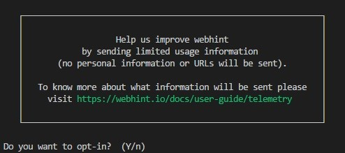
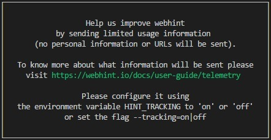

# Telemetry

## What are we tracking

At the end of the second run `webhint` we will ask if you want to
send `limited usage information` to help us to build a better product.

If you answer `yes`, you will grant `webhint` permission to send the
following information:

* The configuration used.
* Unhandled/Uncaught exceptions when runing `webhint`.
* Missed or incompatible packages.
* When a new hint is created using `npm create hint`.
* When there is an error creating a hint using `npm create hint`.
* The configuration created using `npm create hintrc`.
* When a parser is created using `npm create parser`.

If you want to set up the tracking information from the command line you
have two options:

* Run `webhint` with the parameter `--tracking=on|off`.
  > E.g.: `hint http://example.com --tracking=on`
* Configure an environment variable `HINT_TRACKING` with the
  value `on` or `off`.

In a CI environment you need to use one of these two options. If not,
you will see this message:

In case you are using both of them, `--tracking on|off` will have
higher priority.

If you want to see a log in your console about what information `webhint`
is tracking, you can use the parameter `--analytics-debug`.

>E.g.: `hint http://example.com --analytics-debug`

## FAQ

* Where is the data sent to?

  To our Application Insights account.

* Is it sent over HTTPS?

  Yes.

* Is it anonymous?

  Yes, we don't store any information related to the user (we don't have
  that concept, and we don't generate any unique identifier at any time)
  or analyzed URLs.

* Who has access to it?

  The `webhint` core team.
