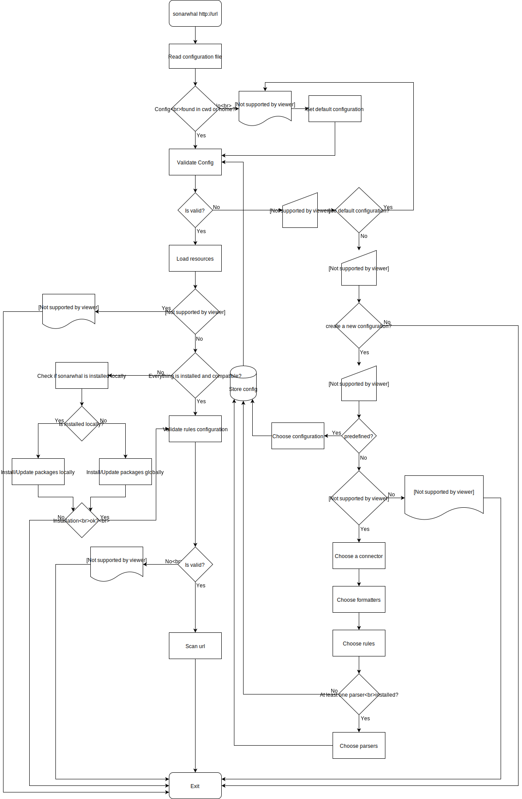

# Architecture

`sonarwhal` was designed with extensibility in mind. At a high level, this is
the project's architecture:

The main piece is `sonarwhal`. It's an object that extends from `EventEmitter`.
This means that the communication between all the different parts is going to
be done mostly via [`event`s][events]. The other pieces are:

* `rule`: Is a group of related tests that are run on a resource (HTML,
  document, image, request, etc.). E.g.: Verify that the HTML document has a
  valid language declared.
  [Learn how to develop a `rule`][new rule].
* `connector`: Is the way in which `sonarwhal` obtains information about the
  DOM, network information, resources, etc. The underlying technique (debugging
  protocol, web driver, etc.) to access this data does not matter to the rest
  of the system.
  [Learn how to develop a `connector`][new connector].
* `formatter`: Transforms the results into something useful to the user. It
  could be as simple as printing out the results to the command line, or
  something more complex like creating an HTML report.
  [Learn how to developer a `formatter`][new formatter].
* `parser`: Understands a particular resource type (e.g.: JavaScript,
  stylesheet, webmanifest, etc.), parses it, and emits related event(s) so
  `rule`s can take action on them.
  [Learn how to develop a `parser`][new parser].

When a user invokes `sonarwhal https://example.com` basically what happens is
this:

1. The `CLI` creates a new `SonarwhalConfig` object based on the user's
   `.sonarwharc` file. This process validates that the rules are configured
   correctly, etc. If the there is no `.sonarwhalrc` file, `sonarwhal` will
   use a [default configuration][default configuration].
1. The `CLI` then passes this `SonarwhalConfig` to the `resource-loader` that
   will return a `SonarwhalResources` object that contains the `Constructors`
   of the configured resources. `resource-loader` checks at the same time if
   the resources actually exist, are compatible with the current `sonarwhal`
   version, etc. If there are missing dependencies, the names will be in the
   `missing` property of the result. For incompatibilities, it will be the
   `incompatible`.
1. If everything goes well, a new `Sonarwhal` object is created using the
   previous `SonarwhalConfig` and `SonarwhalResources`, then `CLI` calls its
   `analyze` method.
1. `sonarwhal` then calls the `collect` method of the configured `connector`.
1. The `connector` will navigate to the `URL` traverse the HTML, and send
   `event`s related to this and the resource loading process.
1. If a `parser` has subscribed to one of the emitted `event`s, it will parse
   that resource and `emit` new `event`s.
1. `rule`s can subscribe to any `event` no matter where it's comming from
   (`connector` or `parser`). If they find an issue, it will be reported via the
   `report` method.
1. Once `sonarwhal` has finished analyzing the website, the results are returned
   to `CLI` that will print them using the configured `formatter`(s).

Any developer can create their own `rule`s, `connector`s, `parser`s
and/or `formatter`s, and use them without having to do a pull request to
the main project and distribute them as [`npm`][npm] packages.

### CLI Flow

You can learn more about how `sonarwhal` loads the configuration and resources
in this diagram:

<!-- Link labels: -->

[events]: ./events.md
[new connector]: ../how-to/connector.md
[new formatter]:../how-to/formatter.md
[new parser]: ../how-to/parser.md
[new rule]: ../how-to/rule.md
[npm]: https://www.npmjs.com/
[typescript]: https://www.typescriptlang.org/
[default configuration]: ../../user-guide/#default-configuration
